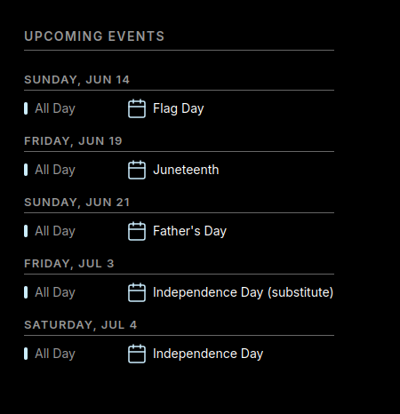

# mirrordash-calendar

Detailed calendar module showing upcoming events for MirrorDash.

## Features
- Supports standard iCalendar (`.ics`) subscriptions from Google Calendar, Apple iCloud, Microsoft Outlook, etc.
- Async parallel fetching of multiple calendars with caching.
- Dynamic color swatches and customizable vector icons for events.

## Installation

```bash
uv pip install -e .
```

## Screenshot



## Troubleshooting

### Calendar events are not showing up
*   Verify that your calendar URL is public and ends with `.ics`. 
*   Google Calendar private links must be the "Secret address in iCal format" found in your Google Calendar settings.

## License
[PolyForm Noncommercial License 1.0.0](LICENSE.md)
